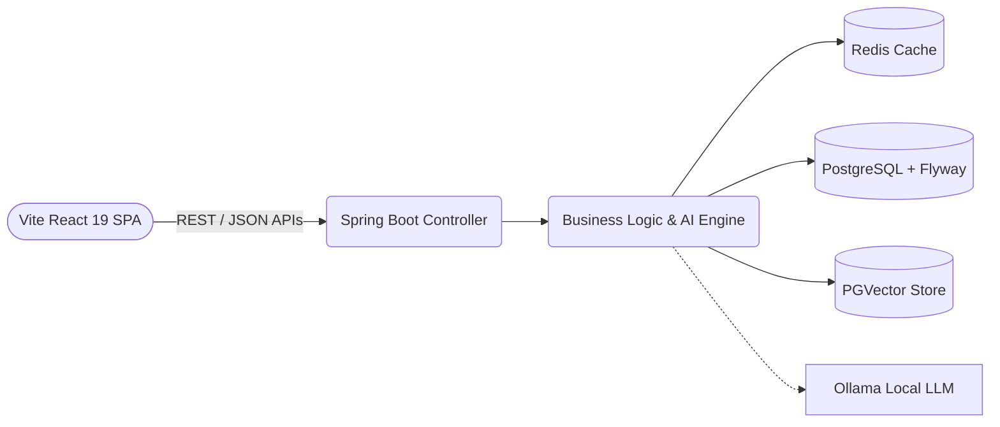

<div align="center">

  <h1>✨ RecontiQ ✨</h1>
  <p><strong>Next-Gen AI-Powered GST Invoice Reconciliation & GSTR-2B Compliance Platform</strong></p>

  <p>
    <a href="#-overview">Overview</a> •
    <a href="#-core-features">Features</a> •
    <a href="#-tech-stack--architecture">Tech Stack & Architecture</a> •
    <a href="#-repository-structure">Repository Structure</a> •
    <a href="#-installation--local-setup">Installation & Setup</a> •
    <a href="#-configuration--security">Configuration & Security</a> •
    <a href="#-api-documentation">API Docs</a>
  </p>

  
  
  
  
  
</div>

---

## 📖 Overview

**RecontiQ** is an enterprise-grade tax reconciliation platform engineered to scale automatically with your business. By harnessing the power of advanced AI models (via local Ollama inference) and vector embeddings (PGVector), RecontiQ drastically improves the precision of detecting invoice discrepancies, maximizing ITC (Input Tax Credit) recovery, and ensuring seamless compliance with the GSTR-2B ecosystem.

Whether you are a growing business dealing with hundreds of monthly statements or an enterprise evaluating millions of transactions, RecontiQ eliminates manual blind spots, streamlines compliance, and intelligently routes real-time risk alerts to your finance team.

---

## ✨ Core Features

- **🧠 Agentic AI Reconciliation**: Intelligent fallback matching logic utilizing Spring AI. It goes beyond simple string matching to perform high-dimensional semantic similarity lookups using PostgreSQL Vector embeddings.
- **🛡️ Intelligent Risk Scoring**: Integrated Machine Learning algorithms that profile vendor reliability, track compliance history, and flag high-risk discrepancies automatically.
- **📈 ITC Optimization Dashboard**: High-fidelity operational cash flow analysis that tracks eligible Input Tax Credit (ITC), highlights missing supplier uploads, and calculates potential tax savings.
- **⚡ High-Performance Caching**: Redis-powered caching for instantaneous dashboard updates, blazingly fast session management, and ultra-low latency API lookups.
- **🔐 Enterprise Security & Controls**: Secure token-based JWT authentication, granular role-based access control, and strictly enforced CORS rules.

---

## 🏗️ Tech Stack & Architecture

RecontiQ is built using a modern, decoupled architecture consisting of a high-throughput **Spring Boot** backend monolith and an interactive, state-of-the-art **React 19** single-page application.

### The Stack
* **Backend**: Java 21, Spring Boot 3.3.5, Spring AI, PostgreSQL with PGVector extension, Redis, Flyway migrations, and JJWT.
* **Frontend**: React 19, Vite, TypeScript, Tailwind CSS v4, Framer Motion (for physics-based animations), and Lucide React.
* **Deployment**: Docker & Docker Compose for containerized multi-service middleware orchestration.

### System Architecture Diagram



---

## 📂 Repository Structure

To optimize developer workflows, the frontend and backend projects are fully decoupled inside independent subdirectories:

```text
impact/                       <-- Root Directory (Open in Terminal for Docker Compose)
├── backend/                  <-- Spring Boot Backend Monolith (Open in IntelliJ IDEA)
│   ├── pom.xml               <-- Maven Dependencies
│   ├── src/                  <-- Application source code & Flyway migrations
│   └── Dockerfile
├── frontend/                 <-- React Vite Frontend Application (Open in VS Code)
│   ├── package.json          <-- Node.js Dependencies
│   ├── vite.config.ts        <-- Vite configuration
│   └── src/                  <-- Component library & dashboard views
├── infra/                    <-- Local Middleware Configurations (PostgreSQL, Redis config)
└── docker-compose.yml        <-- Multi-container docker Orchestration script
```

---

## 🚀 Installation & Local Setup

Get your local environment up and running in minutes by following these step-by-step setup guides.

### 1. Prerequisites
Ensure you have the following installed:
* **Java 21+ (JDK)** & **Maven 3.9+**
* **Node.js (v18+)** & **NPM**
* **Docker Desktop** (or Docker Daemon running)
* **Ollama** (Local LLM environment)

---

### 2. Infrastructure Setup (Docker & Ollama)

#### A. Spin up Middleware Services
From the root repository directory (`d:\impact`), spin up PostgreSQL (with PGVector enabled) and Redis using Docker Compose:
```bash
docker-compose up -d
```

#### B. Configure Ollama & Pull Models
Make sure your Ollama daemon is running, then pull the lightweight LLM and text-embedding models:
```bash
# Pull the LLM for agentic matching decisions
ollama pull llama3.2:1b

# Pull the vector embedding model
ollama pull nomic-embed-text
```

---

### 3. Backend Setup (Spring Boot)

The core Spring Boot API operates on port `8080` by default.

#### A. Navigate to backend directory:
```bash
cd backend
```

#### B. Compile and Run the Server:
```bash
mvn clean install
mvn spring-boot:run
```
> [!NOTE]
> Database schema migrations are managed automatically on startup by Flyway using the scripts located in `/src/main/resources/db/migration`.

---

### 4. Frontend Setup (React & Vite)

The frontend runs on Vite's default dev server port (`5173` or `3000` depending on environment configuration).

#### A. Navigate to the frontend directory:
```bash
cd ../frontend
```

#### B. Install Node packages:
```bash
npm install
```

#### C. Start the Vite Development Server:
```bash
npm run dev
```

Now open [http://localhost:5173](http://localhost:5173) in your web browser to access the beautiful RecontiQ dashboard!

---

## 🔧 Configuration & Security

> [!WARNING]
> **Production Security Best Practice**: Never hardcode production secrets, passwords, or cryptographic keys in `application.yml`, `.env`, or the `README.md` file. Always use environment injection, secure credential stores, or ignored local configuration files.

To override configurations in staging or production environments, you can define these environment variables securely. Notice that placeholders `<...>` should be replaced with your actual secret values in your environment variables runner, and **never committed to your version control**:

| Environment Variable | Local Dev Fallback (Safe) | Description / Purpose |
|---|---|---|
| `SPRING_DATASOURCE_URL` | `jdbc:postgresql://localhost:5432/gst_recon` | Endpoint for the PostgreSQL target instance |
| `SPRING_DATASOURCE_USERNAME` | `<db_username>` | Secure database user with read/write access |
| `SPRING_DATASOURCE_PASSWORD` | `<db_password>` | Password matching the secure database user |
| `SPRING_AI_OLLAMA_BASE_URL` | `http://localhost:11434` | Point to your containerized or local Ollama Daemon |
| `APP_JWT_SECRET` | `<your_secure_256bit_hex_secret>` | Secure high-entropy signature key for signing JWT tokens |

---

## 📚 API Documentation

When the backend server is running locally, interactive API documentation is fully exposed for quick integration and endpoint exploration:

* **Interactive Swagger UI**: [http://localhost:8080/swagger-ui.html](http://localhost:8080/swagger-ui.html)
* **Raw OpenAPI JSON Spec**: [http://localhost:8080/api-docs](http://localhost:8080/api-docs)

---

<div align="center">
  <sub>Built with precision and scalability by the RecontiQ Organization.</sub>
</div>
