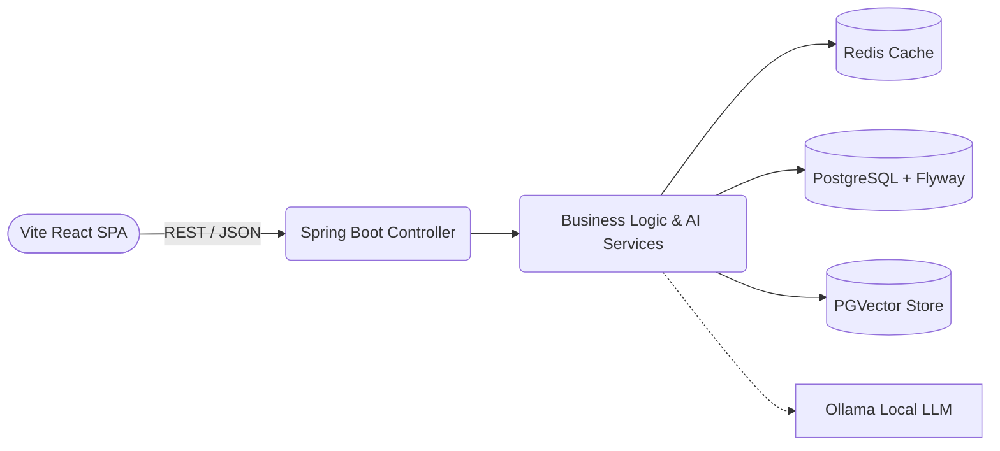

# 🏗️ System Architecture & Tech Stack

## Tech Stack 
The platform is split into a massively scalable Spring Boot monolith and a state-of-the-art responsive React rendering layer.

### Backend (Core Services)
- **Java 21** / **Spring Boot 3.3.5**
- **Spring AI**: Utilizing localized AI with **Ollama** (`llama3.2:1b`, `nomic-embed-text`).
- **PostgreSQL**: Primary data store.
- **PGVector**: Vector database extension for cosine-similarity semantic matching.
- **Redis**: Fast caching tier.
- **Flyway**: Database schema migration and version control.
- **JJWt**: Secure JWT token generation.
- **Docker & Compose**: Containerised robust deployments.

### Frontend (Presentation Tier)
- **React 19**
- **TypeScript** & **Vite** (Next-generation ultra-fast bundler)
- **Tailwind CSS v4** (Seamless styling and dark mode handling)
- **Lucide React** (Beautiful standardized iconography)
- **Framer Motion** (Smooth hardware-accelerated animations)

---

## Architecture Diagram

